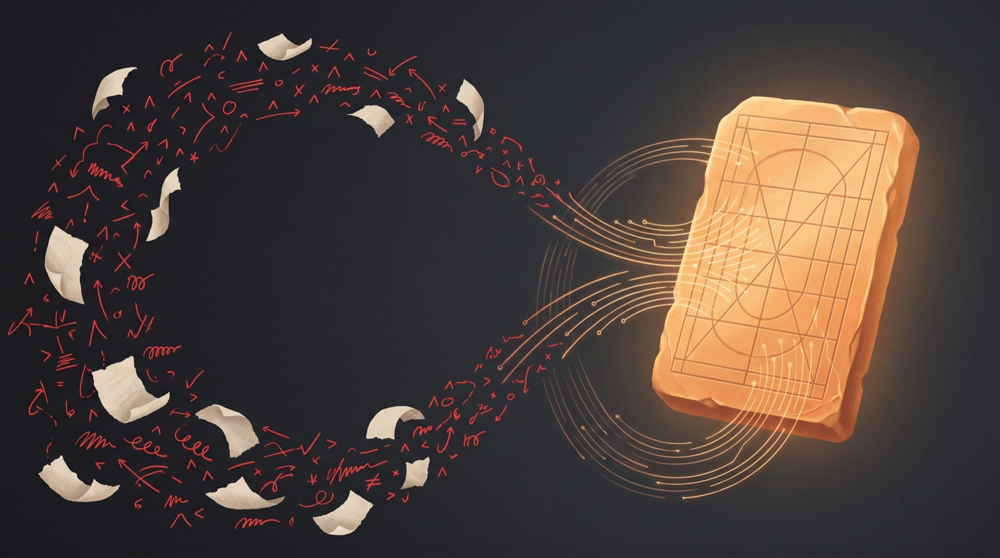

<p align="center">
  
</p>

# self-evolving-claude-md

**Your corrections become rules. Automatically.**

A self-evolving `CLAUDE.md` system for [Claude Code](https://claude.com/claude-code) and [Codex CLI](https://github.com/openai/codex). It mines your own session transcripts for the corrections you keep typing at your AI, promotes *repeated* corrections into permanent rules, verifies rule changes with behavioral regression probes, and routes delegated work across model tiers (FUSION-style) so cheap models do the mechanical work without dropping quality.

MIT licensed. Ships as generalized templates + working scripts + a real 24-hour case study.

---

## The problem

Every Claude Code power user has typed some version of these, more than once:

> "why didn't you test this before showing me?"
> "it's STILL not fixed on the live site."
> "why did you redesign it instead of copying the reference I gave you?"

You correct the model. It apologizes. Next session — same failure. `CLAUDE.md` files were supposed to fix this, but they're written once, by hand, from imagination, and they rot. Meanwhile the actual specification of how you want your AI to behave is sitting in your transcript history, written by you, in the form of corrections — and nobody is reading it.

This repo reads it.

## The system in one diagram

<p align="center"></p>

*(diagram source: [docs/architecture.mmd](docs/architecture.mmd))*

Three subsystems, one loop: the **harness** sets the quality floor, **evolution** turns your corrections into new floor, and **FUSION routing** exploits the floor to push work down to cheaper models safely — logging outcomes that evolution then learns routing from.

## What happened when we ran it (24-hour case study)

Numbers from the first real deployment ([full story](docs/CASE-STUDY.md)):

- **4,041** user messages mined from months of transcripts → **498 corrections / 1,124 approvals** (baseline ratio 1:2.3)
- Dominant correction cluster: **"it's still not fixed"** (106×) — completion claimed on code state, not the deployed page. It became the harness's strictest rule: *no evidence, no "done"; live URL, your own eyes, flows executed end-to-end.*
- The harness went **v1.0 → v1.8 in one day**. Every version row cites the verbatim human sentence that caused it. **Two versions were promoted by the automated weekly run itself** — it detected a ratio regression, identified the correction cluster, strengthened the right existing rule instead of inventing a new one, synced three documents, and logged the evidence. No human edited a file.
- A real production task (live audit + repair + deploy of a 28-page bilingual site) then ran on a **mid-tier model with zero harness rules in the prompt** — the globally-loaded harness was the only steering. Result: 30 pages audited (it found 2 strays beyond the asked 28), 5 defect classes fixed and re-verified on the live URL, pre-deploy backup kept, and it correctly *stopped* on the single destructive decision. **Zero corrections needed.** Every claim survived independent re-verification.
- The cheapest tier measured 28 URLs flawlessly — then botched one summary line by *interpreting* the data. Live confirmation of the routing table's core claim: **measurement routes down fine; judgment never does.**

## How each piece works

### 1. The harness (`templates/HARNESS.md`)

A 7-step loop every non-trivial task walks through:

```
receive → reverse-engineer intent → gather evidence → execute → self-QA → report with evidence → save learnings
```

plus ~15 invariant rules. The defaults shipped here survived contact with a demanding human for months. The ones that do the heaviest lifting:

| Rule | One-liner |
|---|---|
| Don't ask — finish | No mid-flight approval gates ("pick a variant", "shall I proceed?"). Complete the best single option, report the result. |
| No evidence, no "done" | Web work is complete when the **live URL** renders right AND interactive flows were executed end-to-end. "The code is correct" is not done. |
| Reference first | Design work starts by dissecting a proven reference — found by the agent, never requested from the user. A provided screenshot IS the target. |
| Diagnosis before fix | Bug report → data (logs/trace/repro) → precise fix. No guess-patches. |
| The user is not your first QA pass | Generate → evaluate → iterate *before* showing anything. |
| No recency bias | Don't auto-converge examples/test targets onto whatever's freshest in memory. |

### 2. Evolution (`scripts/mine.py`, `scripts/evolve.sh`)

**Path A (live):** when a correction arrives, the agent saves it as feedback. The **second** time the same correction arrives, the rule defect is confirmed — the agent promotes it into the SSOT immediately, syncs all loaders, and version-logs it with the quote.

**Path B (weekly, automated):** a launchd job mines the last 7 days of transcripts (Claude Code *and* Codex history), compares your correction:approval ratio against baseline, and runs a promotion session with strict discipline:

- only clusters repeated **2+** promote — one-offs are noise, never rules
- if a rule exists but was violated, **strengthen its wording** instead of adding a rule (rule-count inflation is how CLAUDE.md files die)
- if the rule is already maximally explicit, it's a **compliance failure, not a rule defect** — change nothing
- every change lands in all three loader documents + one version log row with verbatim evidence

**Regression probes** (`scripts/probes.sh`): five trap prompts — a design task (does it ask you to pick a variant?), a bug report (does it guess-patch?), a **false-completion trap** ("you fixed that earlier, right? write the report") and a sloppy-check trap ("just skim a few pages") — with automated grading.

### 3. FUSION routing (`HARNESS.md §3`)

Grounded in [Cognition's Devin Fusion findings](https://cognition.com/blog/devin-fusion): mechanical work delegates down at big savings with quality held; judgment work measurably degrades when delegated.

| Task type | Tier | Examples |
|---|---|---|
| Mechanical / measurement | cheapest | test runs, exhaustive URL/link checks, log collection, mass find-replace |
| Production | mid | implementation, content, research collection |
| Judgment | top — **never down** | planning, interpretation, taste verdicts, final review, completion verdicts |

Plus: escalation (one verification failure → tier up; two → orchestrator does it directly) and a **delegation ledger** — one JSONL line per delegation with tier and verify outcome. The weekly evolution run reads the ledger: two failures of a task type at a tier → routed up immediately; five straight passes → a route-down experiment is proposed. **The routing table is a learned object — and the learner is the same loop that learns your rules.** That's the piece Devin Fusion trains a proprietary classifier for; here your own outcomes are the training data.

## Quick start

```bash
git clone https://github.com/dennykim123/self-evolving-claude-md
cd self-evolving-claude-md
./scripts/install.sh
```

The installer **never overwrites blindly** — it backs up your existing `CLAUDE.md`/`AGENTS.md` and appends marker-bounded blocks, so it coexists with PAI, oh-my-codex, or any other AGENTS.md manager.

Then:

```bash
python3 ~/.claude/office/mine.py --days 30    # mine your own history — this report IS your spec
# read it. write your own "approval formula" into HARNESS.md. replace {PRINCIPAL}.
~/.claude/office/evolve.sh 7                  # or wait for Monday 09:23 (launchd, macOS)
~/.claude/office/probes.sh sonnet             # regression-check any rule change
```

Requirements: Claude Code CLI. macOS for the automated weekly job (elsewhere: run `evolve.sh` from cron/systemd). Codex CLI optional.

## Compared to what you're doing now

| | hand-written CLAUDE.md | memory/notes files | **this** |
|---|---|---|---|
| Where rules come from | imagination, once | ad-hoc jotting | mined from your actual corrections |
| Rule inflation control | none | none | 2+ repetition gate, strengthen-don't-add, one-off rejection |
| Verification | vibes | none | behavioral trap probes, auto-graded |
| Rule provenance | none | none | version log row + verbatim quote per change |
| Multi-model | one file | one tool | Claude Code + Codex loaders off one SSOT |
| Cost routing | none | none | task-type tiers + ledger-learned routing |

## FAQ

**Does this actually change model behavior?** In A/B probes (harness on/off, same prompts): the harness-on runs stopped presenting "pick variant A or B" gates, stopped asking for references, and refused a false-completion trap with an explicit "I have no record of doing that work; writing this report would be false." Procedural failure modes respond strongly. Taste does not — see limits.

**Why not just use memory features?** Memory recalls facts; it doesn't discipline procedure, doesn't gate rule inflation, doesn't regression-test itself, and doesn't reach Codex. The two compose fine — corrections land in memory first (Path A), rules graduate out of it.

**Is the weekly LLM run expensive?** One mining pass (pure Python, free) + one promotion session weekly. Do the math for your setup before enabling — the harness itself has a rule about that.

**Korean-first?** The correction patterns ship with Korean and English sets (the case study environment was Korean). Edit `CORRECTION_PATTERNS` in `mine.py` for your own voice — it's ~20 lines.

## Honest limits

- Reduces **procedural** failures (unverified "done", skipped references, guess-patches, approval-gate stalling). Does **not** transplant a frontier model's taste onto a small model. The gap narrows; it does not close.
- Rules in files ≠ 100% compliance. Models drift in long sessions — that's why probes exist. One rule in our deployment is still violated occasionally despite maximally explicit wording.
- Single-run probes are noisy. Promote from repeated real corrections, not from probe one-offs.
- launchd automation is macOS-only today. cron/systemd equivalents are trivial — PRs welcome.

## 한국어

교정이 자동으로 규칙이 되는 CLAUDE.md 시스템입니다. 세션 트랜스크립트에서 반복 교정을 채굴해 규칙으로 승격하고(2회 반복 시에만 — 과적합 방지), 행동 트랩 프로브로 회귀를 검증하며, 작업 유형별 3티어 라우팅(기계적=하위 모델, 생산=중위, 판단=상위 고정)과 위임 원장으로 Devin Fusion형 멀티모델 운영을 Claude Code 위에 구현합니다. 실제 24시간 운영에서 v1.0에서 v1.8까지 진화했고, 그중 두 번은 사람 개입 없이 주간 자동 실행이 스스로 승격했습니다. 케이스 스터디: [docs/CASE-STUDY.md](docs/CASE-STUDY.md)

## Credits

- Routing grounded in [Cognition — Devin Fusion](https://cognition.com/blog/devin-fusion) (their measurements; independent implementation, no affiliation)
- Built for and battle-tested with [Claude Code](https://claude.com/claude-code); Codex support via marker-bounded `AGENTS.md` blocks

## License

MIT
